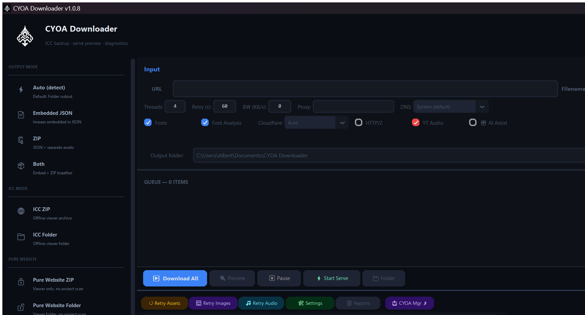

<p align="center">
  <picture>
    <source media="(prefers-color-scheme: dark)" srcset="assets/logo-dark.png">
    
  </picture>
</p>

<h1 align="center">CYOA Downloader</h1>

<p align="center">
  An ICC/CYOA backup utility with a GUI, CLI, JavaScript-aware website archiving,
  batch queues, media recovery, advanced network routing, local previews, and
  output verification.
</p>

<p align="center">
  <a href="https://github.com/Halo1211/CYOA-Downloader/actions/workflows/ci.yml"></a>
  <a href="https://github.com/Halo1211/CYOA-Downloader/releases/latest"></a>
  
  
  <a href="LICENSE"></a>
</p>

> **Important**  CYOA Downloader is an independent community utility. Download
> only content you are permitted to access and retain. It is not affiliated with
> CYOA.CAFE, gallery-dl, or any website handled by the downloader.

<p align="center">
  
</p>

---

## What it does

CYOA Downloader saves interactive web projects for offline inspection. It can
preserve an ICC-style project, archive a normal or JavaScript-driven website,
recover images and media, package the result as a folder or ZIP, and verify
that local references are complete.

The downloader supports four website archive strategies:

- **Classic** preserves the historical single-page workflow.
- **Smart** adds a bounded same-origin story-route crawl.
- **Browser** adds runtime capture for assets exposed only after JavaScript runs.
- **Auto** profiles the target and selects the lightest complete strategy.

Auto mode recognizes ICC project data, CYOA.CAFE records, route trees, and
common runtime frameworks. Login, telemetry, comments, payments, mutations,
and unrelated external domains are not treated as story routes.

### Make an existing CYOA library playable offline

The modernizer distinguishes ICC/ICC Plus legacy bundles, Lt. Ouroumov's
legacy bundle, ICC Plus 2, ICC Remix, and unrelated custom HTML. Legacy
viewers are patched in place. ICC Plus 2 and Remix receive their matching
local runtime, while publisher-authored titles, favicons, fonts, loading CSS,
and extra scripts/styles are retained. Unknown and non-ICC sites are copied
unchanged instead of being forced into an incompatible viewer.

Automatic viewer handling during normal downloads is **off by default**. Open
**Settings → Viewers** to enable either JSON-only viewer injection, full ICC
website modernization, or both. Keep **Auto (recommended)** selected unless
you are testing a particular runtime: Auto uses HTML markers first, then the
`project.json` schema/version (2.x → ICC Plus 2; unversioned ICC → Legacy).
The Settings checklist shows whether the recommended Plus 2, Legacy, Remix,
and Lt. Ouroumov-compatible viewer families are registered.

Viewer registration accepts `.zip`, `.rar`, and an already-unpacked viewer
folder; folders are packaged into the private registry without modifying the
source. ICC Plus 2 automation accepts only release assets labelled
`local`, `offline`, or `standalone`. It never falls back to the online viewer.

```powershell
python cyoa_downloader.py `
  --modernize-library "E:\CYOA" `
  --viewer-collection "E:\CYOA Viewer Collection" `
  --modernize-output "E:\CYOA\_edited"
```

The destination must be empty or absent. The original library is never
modified, and `conversion_report.json` records the detected family, strategy,
changed files, and any failure for every discovered site. Whenever a viewer
runtime file or `index.html` must be replaced, its original bytes are retained
under that site's `__original_site__` directory. Publisher-specific loading
CSS, fonts, favicons, and unrelated scripts/styles remain active in place.
Replacement templates are validated before any in-place overlay, and rerunning
modernization safely refreshes project data without replacing the first
original backup.

See the [JavaScript Archive Guide](docs/JAVASCRIPT_ARCHIVE_GUIDE.md) and
[Auto Safe Archive notes](docs/AUTO_SAFE_ARCHIVE.md) for the complete behavior.

## Start quickly

### Windows executable

Download `CYOA-Downloader-Windows-x64.zip` from the
[GitHub Releases page](https://github.com/Halo1211/CYOA-Downloader/releases),
extract it, and run `CYOA Downloader.exe`. The executable is unsigned, so
Windows SmartScreen may require confirmation.

Large or machine-specific helpers are detected separately instead of being
silently bundled:

- FFmpeg for media conversion and merging;
- Deno plus `yt-dlp-ejs` for current YouTube extraction;
- Chrome/Chromium and a driver for Selenium fallback;
- Playwright Chromium for browser automation;
- unrar or 7-Zip for RAR extraction.

### Run from source

```powershell
py -3 -m venv .venv
.\.venv\Scripts\Activate.ps1
python -m pip install --upgrade pip
pip install -r requirements.txt
python cyoa_downloader.py --dependency-check
python cyoa_downloader.py
```

Optional recovery and batch packages can be installed with:

```powershell
pip install -r requirements-optional.txt
python -m playwright install chromium
```

## GUI workflow

Run `python cyoa_downloader.py` without arguments to open the GUI. For a
JavaScript-heavy project:

1. Choose **Pure Website Folder**.
2. Open **Settings**.
3. Set **JavaScript Archive Policy** to **Auto**.
4. Configure the page and depth safety caps.
5. Add the URL to the queue and select **Download All**.
6. Open the result with **Serve**; modern JavaScript applications should not
   rely on direct `file://` access.

Large route-based stories can start with 800 pages and a depth of 30. These are
safety caps, not targets: discovery stops when no new routes or assets appear.

Each queued URL keeps its own filename and output mode. Select a row's mode
badge to change it without deleting and re-adding the URL. **Export List…**
writes the queue to CSV or TXT for later import. See the
[GUI Queue Guide](docs/GUI_QUEUE_GUIDE.md).

## Advanced network settings

Open **Settings → Network** to configure:

- environment, disabled, or manual proxy mode;
- common and per-scheme HTTP/HTTPS proxies;
- HTTP, HTTPS, SOCKS4, SOCKS5, and `socks5h` routing;
- proxy bypass/`NO_PROXY` hosts;
- system DNS, UDP, TCP, DNS-over-HTTPS, or DNS-over-TLS;
- Cloudflare `1.1.1.1`, Google, Quad9, BebasDNS, DoH, and DoT presets;
- DNS timeout, IPv6, system fallback, and custom ports;
- a fail-closed, application-level VPN interface guard.

The compact Proxy and DNS controls in the main GUI remain synchronized with
the advanced profile. **Validate offline** checks the configuration and local
network interfaces without requesting a website or public test URL.

The VPN guard does not create, start, or reconfigure a VPN tunnel. `system`
uses the operating system route table. `require` blocks downloader traffic when
the requested VPN-like interface is not active. For proxy-side hostname
resolution, prefer `socks5h://`.

Example DoH, SOCKS, and required VPN configuration:

```powershell
python cyoa_downloader.py URL `
  --dns-protocol doh `
  --dns https://cloudflare-dns.com/dns-query `
  --no-dns-fallback-system `
  --proxy-mode manual `
  --proxy socks5h://127.0.0.1:1080 `
  --vpn-policy require `
  --vpn-interface WireGuard
```

See the [Network, DNS, Proxy, and VPN Guard Guide](docs/NETWORK_GUIDE.md) for
the transport matrix, privacy trade-offs, and troubleshooting steps.

## Discord attachment recovery

Discord attachment recovery is integrated into the normal download pipeline.
When an attachment CDN URL has expired, the downloader can use Discord API v10
to refresh it and then replace the project reference with the downloaded local
asset.

Set a bot token for one process with:

```powershell
$env:DISCORD_BOT_TOKEN = "YOUR_BOT_TOKEN"
python cyoa_downloader.py "https://example.com/cyoa/" -o "output"
```

The GUI field is available under **Settings / Maintenance → Discord Bot
Token**. Use a bot token from the Discord Developer Portal—never a password,
user token, or personal account token. Existing attachment URLs do not require
reading channels or messages. See the
[Discord Attachment Recovery Guide](docs/DISCORD_ATTACHMENTS_GUIDE.md).

## Settings and safety

Active settings are stored in `~/.cyoa_downloader/settings.json`. Invalid
manually edited values are normalized to safe ranges. Portable settings export
removes secret fields automatically, but the active settings file can still
contain plain credentials and must not be shared.

Safe browser interaction permits a narrow allowlist such as **Load More** or
**Show More**. Form submission, login, voting, comments, reports, payments,
popups, and mutation requests remain blocked.

Cloudflare handling uses a normal request first and activates a configured
fallback only when a challenge is detected. Example:

```powershell
python cyoa_downloader.py URL --cloudflare auto --cloudflare-priority flaresolverr-first
```

## CLI examples

```powershell
python cyoa_downloader.py --help
python cyoa_downloader.py --dependency-check
python cyoa_downloader.py --self-test
python cyoa_downloader.py "https://example.com/story/" `
  --pure-website-folder `
  --archive-strategy auto `
  --archive-max-pages 800 `
  --archive-max-depth 30 `
  --output "output"
python cyoa_downloader.py --verify "output"
```

## Diagnostics and media helpers

The Diagnostics panel checks Python packages, command-line tools, browser
backends, write permissions, settings, cache state, and frozen PyInstaller
resources. A missing optional helper only disables the related feature.

Missing site assets are never replaced with placeholders or removed from the
downloaded markup/project data. Their original references remain intact and
the failure is written to `failed_assets.txt`, `failed_images.txt`,
`backup_report.txt`, or `skipped_youtube_audio.txt` as appropriate. A similarly
named local file with another extension is not substituted automatically.

Current YouTube extraction normally requires an up-to-date `yt-dlp`, the
`yt-dlp-ejs` package, and a JavaScript runtime such as Deno. A cookie file does
not replace those components. Never commit cookies, settings, API keys, bot
tokens, or downloaded content.

## Build the Windows package

```powershell
.\tools\build_windows.ps1
```

If PowerShell policy blocks scripts:

```powershell
powershell -NoProfile -ExecutionPolicy Bypass -File .\tools\build_windows.ps1
```

The build creates `dist\CYOA-Downloader-Windows-x64.zip`. FFmpeg, Deno,
browsers, and RAR helpers remain diagnosed external dependencies.

## Repository map

| Path | Purpose |
| --- | --- |
| `cyoa_downloader.py` | CLI and GUI entry point |
| `cyoa_downloader_app/` | Application packages |
| `docs/` | User, troubleshooting, and maintainer guides |
| `examples/` | Safe sample batch inputs and templates |
| `tests/` | Offline regression tests |
| `tools/` | Verification and Windows build helpers |
| `.github/` | CI, issue templates, and release automation |

## Development and verification

```powershell
python -m pip install -r requirements-dev.txt
python -m compileall -q cyoa_downloader_app cyoa_downloader.py
python -m pytest -q
ruff check cyoa_downloader.py cyoa_downloader_app
```

The current offline regression suite contains 501 passing tests with 8 optional
tests skipped when their runtime conditions are unavailable.

Read [CONTRIBUTING.md](CONTRIBUTING.md) before submitting changes. Security
reports belong in [SECURITY.md](SECURITY.md). This project is distributed under
the [MIT License](LICENSE).
